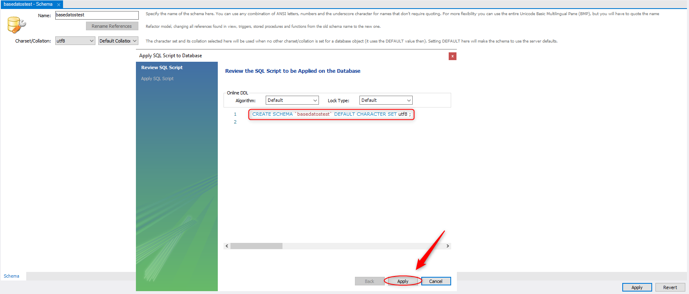
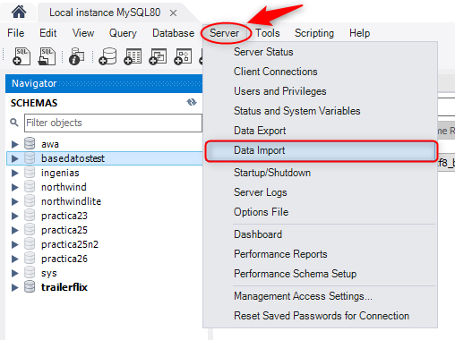
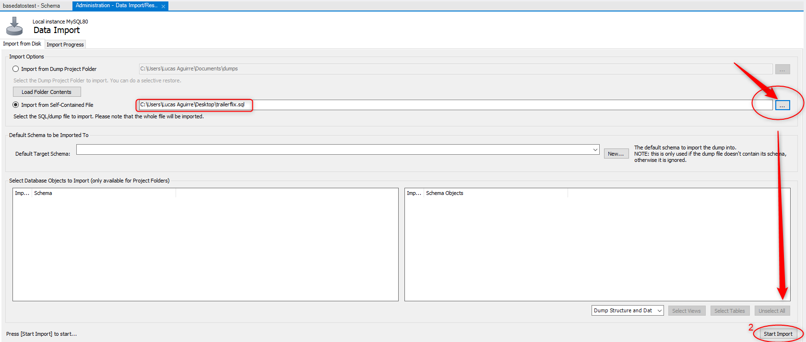
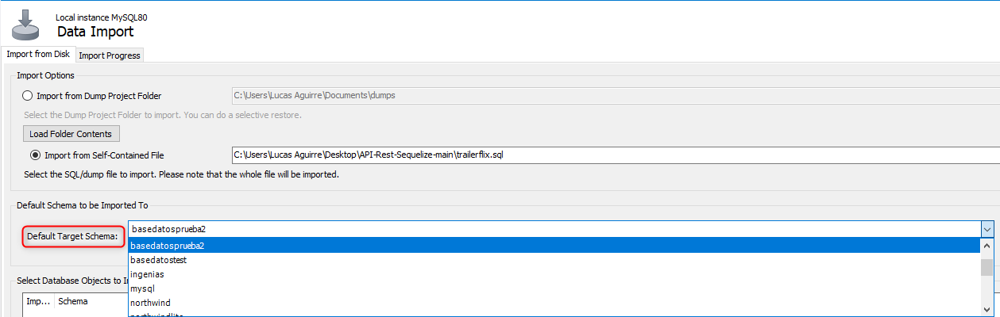
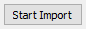
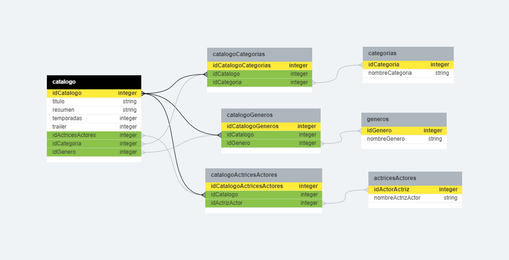
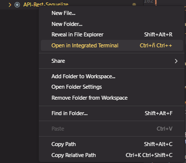

# Documentación del Proyecto

## 1. Configuración del Entorno

## El proyecto utiliza variables de entorno mediante el paquete `dotenv`. Asegúrate de **MODIFICAR** el archivo .env con las configuraciones necesarias.

```dotenv
DBUSER=TU_USUARIO
PASSWORD=TU_CONTRASEÑA
DATABASE=EL_NOMBRE_DE_LA_BASE_DE_DATOS_CREADA_Y_CON_LOS_DATOS_IMPORTADOS

HOST=localhost
PORT=3008
```

### 1.1 También asegurate de importar los datos de la base de datos desde el archivo trailerflix.sql adjunto en el proyecto. Para ello:

### 1.2 Crea un nuevo esquema:



### 1.3 Importa los datos:



### 1.4 Selecciona el archivo **trailerflix.sql**:



### 1.5 Selecciona la base de datos creada:



### 1.6 Presiona en Start Import:



## 2. Estructura del Proyecto

La estructura del proyecto es la siguiente:

```
├── conection/
│   └── conection.js
├── models/
│   ├── ActricesActores.js
│   ├── Categorias.js
│   ├── Catalogo.js
│   ├── Generos.js
│   └── VistaCatalogo.js
├── views/
│   ├── actores.ejs
│   ├── categorias.ejs
│   ├── catalogo.ejs
│   └── generos.ejs
├── .env
├── server.js
├── package.json
└── ...
```

### 2.1 El diagrama de entidad relación es el siguiente:



### 2.2 Creación de la vista SQL utilizada para solicitar el catalogo

```
SELECT
    catalogo.idCatalogo,
    catalogo.poster,
    catalogo.titulo,
    c.nombreCategoria AS categoria,
    GROUP_CONCAT(DISTINCT g.nombreGenero SEPARATOR ', ') AS generos,
    catalogo.resumen,
    catalogo.temporadas,
    GROUP_CONCAT(DISTINCT ac.nombreActrizActor SEPARATOR ', ') AS reparto,
    catalogo.trailer
FROM
    catalogo
JOIN
    catalogocategorias ON catalogo.idCatalogo = catalogocategorias.idCatalogo
JOIN
    categorias c ON catalogocategorias.idCategoria = c.idCategoria
JOIN
    catalogogeneros ON catalogo.idCatalogo = catalogogeneros.idCatalogo
JOIN
    generos g ON catalogogeneros.idGenero = g.idGenero
JOIN
    catalogoactricesactores ON catalogo.idCatalogo = catalogoactricesactores.idCatalogo
JOIN
    actricesactores ac ON catalogoactricesactores.idActrizActor = ac.idActrizActor
GROUP BY
    catalogo.idCatalogo, catalogo.poster, catalogo.titulo, categoria, catalogo.resumen, catalogo.temporadas, catalogo.trailer;
```

## 3. Instalación de Dependencias

Antes de ejecutar el servidor, instala las dependencias utilizando el siguiente comando:

```
npm install
```

## 4. Iniciar el Servidor

Ejecuta el siguiente comando para iniciar el servidor:

```
npm start
```

### 4.1 Si tienes problemas para ejecutar el comando intenta hacer lo siguiente:



Y ejecuta el comando el la terminal abierta.

```
npm start
```

El servidor estará disponible en http://localhost:3000/catalogo.

## 5. Rutas de la API

## 5.1 Obtener Categorías

Ruta:

```
/categorias
```

Método: GET

Descripción: Obtiene todas las categorías disponibles.
Ejemplo de Uso:

```
http://localhost:3000/categorias
```

## 5.2 Obtener Géneros

Ruta:

```
/generos
```

Método: GET

Descripción: Obtiene todos los géneros disponibles.

Ejemplo de Uso:

```
http://localhost:3000/generos
```

## 5.3 Obtener Actores y Actrices

```
Ruta: /actores
```

Método: GET

Descripción: Obtiene la lista completa de actores y actrices.

Ejemplo de Uso:

```
http://localhost:3000/actores
```

## 5.4 Filtrar el Catálogo

```
Ruta: /catalogo
```

Método: GET

Parámetros de Consulta:

```
nombre:  // Filtrar por nombre.
genero:  //Filtrar por género.
categoria:  //Filtrar por categoría.
```

Descripción: Obtiene el catálogo completo o filtrado según los parámetros especificados.
Ejemplo de Uso:

# Filtrar por nombre

```
http://localhost:3000/catalogo?nombre=Avengers
```

# Filtrar por género

```
http://localhost:3000/catalogo?genero=Action
```

# Filtrar por categoría

```
http://localhost:3000/catalogo?categoria=Movies
```

## 5.5 Obtener Detalles del Catálogo por ID

Ruta:

```
/catalogo/:id
```

Método: GET
Parámetros de Ruta:

```
id: Identificador único del catálogo.
```

Descripción: Obtiene los detalles del catálogo según el ID proporcionado.

Ejemplo de Uso:

```
http://localhost:3000/catalogo/1 6. Manejo de Errores
```

El servidor maneja los siguientes mensajes de error:

- 404 Not Found: No se encontraron datos.
- 500 Database Error: Error en la base de datos.
- 500 Server Error: Error en el servidor.
